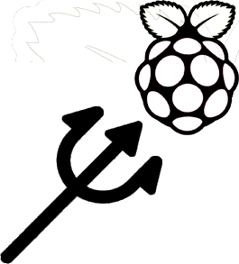

> # **POSEIDON - RASPBERRY PI**

Gestion des paramètres environnementaux (Température, Pression de l'air, Humidité) d'une salle serveur, avec interface et système de notification par email, ainsi que sauvegarde sur base de données distante via MQTT.

 

## **Technologies utilisées**

- Python 3
  - Flask
  - Paho-MQTT
  - Pygal
  - Logging.handlers
- Sqlite 3
- Observium
- HTML/CSS
- MQTT
- Bash

