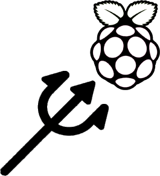

<h1 align="center">POSEIDON - RASPBERRY PI</h1>

 

Gestion des paramètres environnementaux (Température, Pression de l'air, Humidité) d'une salle serveur, avec interface et système de notification par email, ainsi que sauvegarde sur base de données distante via MQTT.

- Python 3
  - Flask
  - Paho-mqtt
  - Pygal
  - Logging.handlers
- Sqlite 3
- HTML/CSS
- MQTT
- Bash

